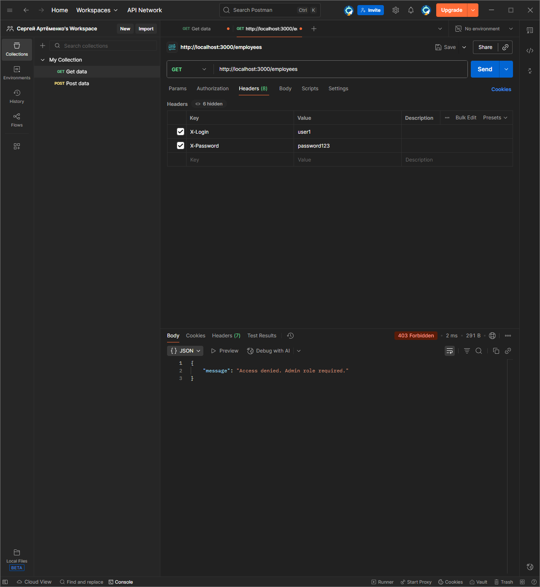
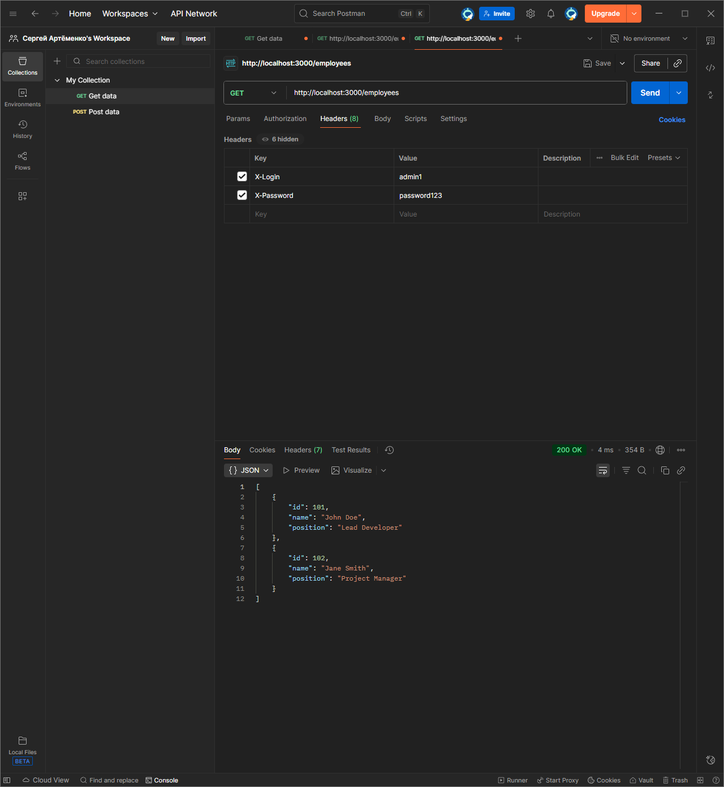
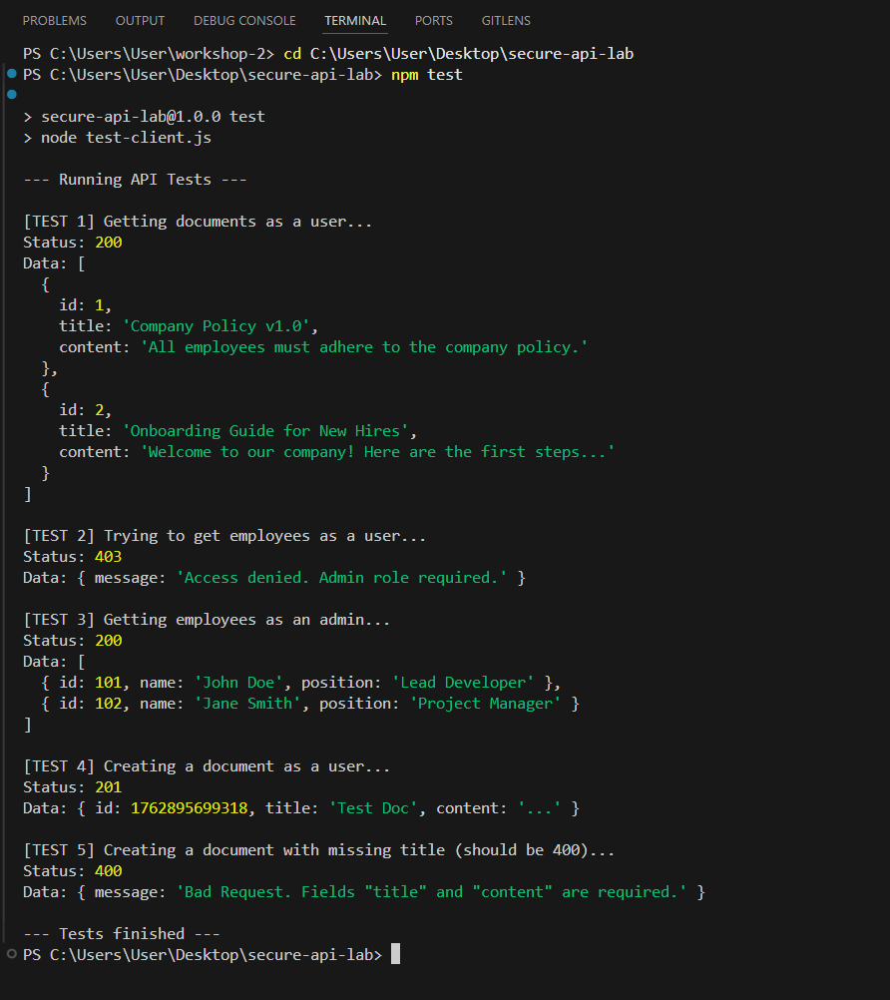

# Лабораторно-практична робота №3
## Розробка та тестування захищеного REST API на Node.js та Express

### Мета роботи
Закріпити навички створення REST API та реалізувати **аутентифікацію**, **авторизацію** та **логування** на базі Node.js + Express.

---

## 1. Встановлення та запуск проєкту

### Клонування репозиторію
```
git clone https://github.com/Siropzik/secure-api-lab.git
cd secure-api-lab
```

### Встановлення залежностей
```
npm install
```

### Запуск сервера
```
npm start
```
Сервер доступний за адресою:
```
http://localhost:3000
```

### Запуск автоматичного тестування
```
npm test
```

---

## 2. Структура проєкту
```
secure-api-lab/
├─ screenshots/           # Скриншоти тестування API у Postman
├─ data.js                # Дані користувачів, документів та співробітників
├─ server.js              # Сервер, маршрути та middleware авторизації
├─ test-client.js         # Автоматичне тестування API
├─ package.json           # Скрипти npm та залежності
└─ .gitignore             # Ігнорування node_modules
```

---

## 3. Опис REST API

| Метод  | Ендпоінт           | Опис дії                                  | Заголовки (Auth)               | Роль        | Тіло запиту                                | Коди відповіді |
|--------|-------------------|-------------------------------------------|--------------------------------|-------------|--------------------------------------------|----------------|
| GET    | /documents        | Отримати список документів                | X-Login, X-Password            | user/admin  | -                                          | 200 OK         |
| GET    | /documents        | Доступ без авторизації                    | _відсутні_                     | -           | -                                          | 401 Unauthorized |
| POST   | /documents        | Створити документ                         | X-Login, X-Password            | user/admin  | { "title": "...", "content": "..." }       | 201 Created    |
| POST   | /documents        | Створення з помилкою (без title або content) | X-Login, X-Password          | user/admin  | { "content": "..." }                       | 400 Bad Request |
| GET    | /employees        | Отримати список співробітників (admin)    | X-Login, X-Password            | admin       | -                                          | 200 OK         |
| GET    | /employees        | Спроба доступу user до admin ресурсу      | X-Login, X-Password            | user        | -                                          | 403 Forbidden  |
| DELETE | /documents/:id    | Видалити документ (admin)                 | X-Login, X-Password            | admin       | -                                          | 204 No Content |
| DELETE | /documents/:id    | Видалення неіснуючого документа           | X-Login, X-Password            | admin       | -                                          | 404 Not Found  |
| GET    | /будь-що-інше     | Звернення до неіснуючого маршруту         | будь-які або відсутні          | будь-хто    | -                                          | 404 Not Found  |


---

## 4. Скриншоти тестування API у Postman

### 1) GET /documents — user


### 2) GET /employees — user (403 Forbidden)


### 3) GET /employees — admin


### 4) POST /documents — 201 Created


### 5) POST /documents без title — 400 Bad Request


### 6) DELETE /documents/:id — 204 No Content (admin)


### 7) GET /documents без заголовків — 401 Unauthorized


### 8) GET /random-url — 404 Not Found


---

## 5. Результат виконання `npm test`


---

## 6. Посилання на репозиторій
```
https://github.com/Siropzik/secure-api-lab
```

---

## 7. Висновки
У ході виконання роботи було створено серверний REST API з підтримкою:

* аутентифікації за заголовками `X-Login` та `X-Password`
* авторизації за ролями (`user`, `admin`)
* логування запитів
* обробки помилок з коректними HTTP статусами

API протестовано у Postman і автоматично через `npm test`.
